# Modelo físico de datos — CuyCash

Diseño relacional de las 6 épicas de "Banca Online Integral". Motor:
PostgreSQL 16 (Neon). El acceso a datos pasa por SQLAlchemy 2.0 en el backend y
por el patrón Repository en la app.

**Estado de implementación.** El diagrama mezcla lo implementado y lo diseñado;
el listado de la sección "Tablas implementadas" y `services/api/app/db/models.py`
son la referencia de lo que existe de verdad (`services/api/schema.sql` se
genera de esos modelos). El código implementa las épicas 1 y 2 y una parte de la
3: la transferencia entre cuentas CuyCash. Las tablas del resto de las épicas
están diseñadas y documentadas aquí, y se crean en el sprint que les
corresponde. Se
diseñan todas juntas porque el libro mayor de la épica 2 es el centro al que
las demás escriben: definirlo sin saber quién lo va a usar obliga a rehacerlo.

| Épica | Sprint | Tablas | Estado |
|---|---|---|---|
| 1 · Identidad y accesos | 1 | 8 | Implementada |
| 2 · Cuentas y libro mayor | 2 | 3 | Implementada |
| 3 · Transferencias y antifraude | 3 | 3 | Parcial |
| 4 · Préstamos digitales | 4 | 4 | Diseñada |
| 5 · Billetera y QR | 5 | 2 | Diseñada |
| 6 · Conciliación y cumplimiento | 6 | 4 | Diseñada |

Épica 3, parcial: están implementadas `transfers` (solo entre cuentas CuyCash,
por DNI) y `beneficiaries` (frecuentes). **Pendientes:** la transferencia
interbancaria y por CCI, y el antifraude (`fraud_alerts`). Las cuentas, el libro
mayor y la recarga de la épica 2 no tienen tabla propia de recarga: una recarga
es una `transaction` de tipo `recarga` contra la cuenta de sistema.

---

## Diagrama relacional

```mermaid
erDiagram
    users ||--o{ devices : "vincula"
    users ||--o{ sessions : "abre"
    users ||--o{ kyc_verifications : "verifica"
    users ||--o{ accounts : "titular de"
    users ||--o{ beneficiaries : "registra"
    users ||--o{ loans : "solicita"
    users ||--o{ notifications : "recibe"
    users ||--o{ watchlist_screenings : "es cotejado en"

    accounts ||--o{ ledger_entries : "afectada por"
    accounts ||--o{ transfers : "origen de"
    accounts ||--o{ transfers : "destino de"
    accounts ||--o{ qr_codes : "cobra en"
    accounts ||--o{ loans : "desembolsa en"

    transactions ||--|{ ledger_entries : "se compone de"
    transactions ||--o| transfers : "materializa"
    transactions ||--o| qr_payments : "materializa"
    transactions ||--o| loan_installments : "paga"
    transactions ||--o{ fraud_alerts : "dispara"
    transactions ||--o{ reconciliation_items : "concilia"

    qr_codes ||--o{ qr_payments : "es cobrado por"
    loans ||--|{ loan_installments : "se paga en"
    loans ||--|| loan_contracts : "formaliza"
    loan_applications ||--o| loans : "origina"
    reconciliation_runs ||--|{ reconciliation_items : "agrupa"

    users {
        uuid id PK
        varchar dni UK "8 dígitos"
        varchar nombres
        varchar apellidos
        varchar email
        varchar alias
        varchar pin_hash "argon2id"
        timestamptz pin_updated_at
        varchar kyc_status
        timestamptz created_at
    }

    accounts {
        uuid id PK
        uuid user_id FK "nulo solo en la cuenta de sistema"
        varchar numero UK "14 dígitos"
        varchar tipo "ahorro | corriente | sistema"
        varchar moneda "PEN | USD"
        varchar estado "activa | bloqueada | cerrada"
        bigint saldo_disponible "céntimos"
        bigint saldo_contable "céntimos"
        timestamptz created_at
    }

    transactions {
        uuid id PK
        varchar tipo "transferencia | recarga | pago_qr | desembolso | cuota | ajuste"
        varchar estado "pendiente | confirmada | revertida"
        varchar idempotency_key UK
        varchar referencia
        varchar request_fingerprint "huella de los parámetros"
        timestamptz created_at
    }

    ledger_entries {
        uuid id PK
        uuid transaction_id FK
        uuid account_id FK
        varchar direccion "debito | credito"
        bigint monto "céntimos, siempre positivo"
        varchar moneda
        bigint saldo_posterior "céntimos"
        timestamptz created_at
    }

    transfers {
        uuid id PK
        uuid transaction_id FK,UK
        uuid cuenta_origen FK
        uuid cuenta_destino FK
        bigint monto "céntimos"
        varchar motivo "opcional, 40"
        varchar estado
    }

    beneficiaries {
        uuid id PK
        uuid user_id FK
        varchar beneficiario_dni "8 dígitos; UK con user_id"
        varchar apodo "40"
        timestamptz created_at
    }

    fraud_alerts {
        uuid id PK
        uuid transaction_id FK
        uuid user_id FK
        varchar tipo "geolocalizacion | monto_inusual | suplantacion"
        int score
        varchar estado "abierta | descartada | confirmada"
        timestamptz created_at
    }

    qr_codes {
        uuid id PK
        uuid account_id FK
        varchar tipo "estatico | dinamico"
        bigint monto "nulo en estático"
        varchar payload_hash
        timestamptz expires_at
        varchar estado "vigente | usado | vencido"
    }

    qr_payments {
        uuid id PK
        uuid qr_id FK
        uuid transaction_id FK
        timestamptz created_at
    }

    loans {
        uuid id PK
        uuid user_id FK
        uuid account_id FK "cuenta de desembolso"
        bigint principal
        numeric tcea
        int plazo_meses
        varchar estado
        timestamptz desembolsado_at
    }

    loan_installments {
        uuid id PK
        uuid loan_id FK
        uuid transaction_id FK "nulo si no se ha pagado"
        int numero
        date vencimiento
        bigint capital
        bigint interes
        varchar estado "pendiente | pagada | vencida"
    }
```

> Lo que el diagrama muestra de `transfers` es solo lo implementado. Las
> columnas `destino_externo` (CCI o celular) y `canal` (propia | terceros |
> interbancaria) y un `cuenta_destino` nulo para destinos externos están
> **diseñadas pero no existen**: llegan con la transferencia interbancaria. Hoy
> `cuenta_destino` es obligatoria. `fraud_alerts`, `qr_codes`, `qr_payments`,
> `loans` y `loan_installments` del diagrama tampoco existen todavía.
>
> El diagrama omite las tablas de soporte de identidad (`lockouts`,
> `login_attempts`, `otp_challenges`, `otp_tickets`) y las de cumplimiento
> (`reconciliation_runs`, `watchlist_screenings`, `notifications`,
> `audit_log`) para que sea legible. Están descritas abajo.

---

## Decisiones de diseño

### 1 · El dinero se guarda en céntimos, como entero

Ningún importe usa coma flotante. `10.10 + 20.20` en punto flotante no da
`30.30`, y en un libro mayor ese residuo es una partida descuadrada. Se guarda
el monto en la unidad mínima (céntimos de sol) como `BIGINT`, y la conversión a
soles ocurre solo al mostrar.

### 2 · Partida doble: el asiento es la verdad, el saldo es la caché

`ledger_entries` registra cada movimiento como débito o crédito contra una
cuenta. Una `transaction` agrupa los asientos de una misma operación, y la
regla es invariable:

> La suma de los débitos de una transacción es igual a la suma de sus créditos.

Esto cumple el SLA de la HU18 — atómico: débito y crédito, o ninguno — porque
los asientos de una transacción se insertan dentro de la misma transacción de
base de datos. La igualdad de débitos y créditos la **verifica el código**
(`app/services/ledger.py`, único punto de escritura del libro), no una
restricción de la base: el esquema solo impone que el monto sea positivo y que
la dirección sea `debito` o `credito`.

`accounts.saldo_disponible` es una columna, no una suma de los asientos.
Calcular el saldo sumando el historial completo es correcto pero no sostiene el
SLA de 200 ms de la HU17 cuando una cuenta acumula miles de movimientos. La
columna se actualiza en el mismo `COMMIT` que los asientos, de modo que nunca
puede divergir, y el historial sigue siendo la fuente auditable para
reconstruirla.

### 3 · Anti doble gasto: bloqueo de fila, no de tabla

Antes de debitar se toma la fila de la cuenta con `SELECT ... FOR UPDATE`. Dos
pagos simultáneos sobre el mismo saldo se serializan: el segundo espera, vuelve
a leer el saldo ya rebajado y es rechazado si no alcanza. Sin ese bloqueo, las
dos lecturas ven el mismo saldo y las dos aprueban.

Es bloqueo por fila: dos cuentas distintas no se estorban, así que el SLA de
200 ms no debería degradarse bajo concurrencia (no hay medición automatizada de
esa cifra). `FOR UPDATE` solo tiene efecto en Postgres; los tests de
concurrencia llevan la marca `postgres` y se omiten en SQLite. **Nunca se han
ejecutado contra un Postgres real**: el orden de bloqueo del `FOR UPDATE` y la
ventana de idempotencia están razonados, no probados.

Además, `accounts` lleva un `CHECK (tipo = 'sistema' OR saldo_disponible >= 0)`
como última defensa contra el doble gasto. La cuenta de sistema —contraparte de
cada recarga— queda en negativo por diseño: su saldo es el dinero inyectado.

### 4 · Idempotencia por restricción única, no por lógica

`transactions.idempotency_key` tiene índice único. El cliente genera la clave y
la repite si reintenta por timeout o red caída. El segundo intento choca contra
la restricción y se devuelve la transacción original en lugar de crear otra.

Esto es lo que cumple el "una sola autorización por pago" de la HU16. Se delega
en la base y no en código porque es la única capa que ve todos los intentos
simultáneos. Hoy lo usan el envío y la recarga; el pago QR no existe aún.

Repetir una clave con **otros** parámetros no es un reintento: la columna
`request_fingerprint` guarda una huella de la petición, y una clave reutilizada
con datos distintos se rechaza con 409 en lugar de devolver la operación
original. El reintento legítimo devuelve 200 con la misma transacción.

### 5 · Los estados son columnas de texto acotado, no enumerados de Postgres

`ENUM` nativo obliga a una migración para añadir un valor. Con `VARCHAR` más una
restricción `CHECK` se consigue la misma garantía y el cambio es barato, que es
lo que necesita un producto que todavía está descubriendo sus estados.

Matiz: hoy los `CHECK` existen en `accounts`, `transactions` y `ledger_entries`.
Las columnas de estado de `users`, `transfers` y las tablas de identidad son
`VARCHAR` sin `CHECK`; el código las acota, la base no.

### 6 · Nada se borra: los movimientos no tienen `DELETE`

Una operación equivocada se corrige con una transacción inversa que deja su
propio rastro, nunca borrando asientos. Es un requisito contable y, de paso, la
base de la trazabilidad que exige la auditoría. Hoy esto se cumple porque
ninguna ruta borra movimientos, no porque la base lo impida. Los únicos datos
que sí se borran son los frecuentes (`DELETE /v1/beneficiaries/{id}`), que no
son dinero.

---

## Tablas de soporte

### Identidad (épica 1, implementada)

| Tabla | Rol |
|---|---|
| `devices` | Teléfonos vinculados. Sin vínculo, entrar exige OTP. Lleva `nombre` (String 80) y `plataforma` (String 20), nulables, tomados de `X-Device-Name` (`plataforma\|modelo`); solo sirven para mostrar. |
| `biometric_credentials` | Secreto que libera la huella. Columnas: `id`, `user_id`, `device_id`, `secret_hash` (único, SHA-256), `created_at`, `revoked_at`. Revocar es poner `revoked_at`; la fila no se borra ni vuelve a valer. |
| `sessions` | Sesiones abiertas. Guarda el hash del token, no el token. |
| `lockouts` | Bloqueos vigentes por DNI y por dispositivo, con nivel de escalado. |
| `login_attempts` | Una fila por intento. Sostiene la ventana deslizante y la auditoría. |
| `otp_challenges` | Desafío OTP con su código hasheado, vigencia y contadores. |
| `otp_tickets` | Prueba de que un OTP se verificó. Lo exige el restablecimiento de PIN. |
| `kyc_verifications` | Veredicto y distancias faciales. **Nunca las imágenes.** |

Nota: `devices.nombre`, `devices.plataforma` y la tabla `biometric_credentials`
son posteriores; `create_all` no altera tablas existentes, así que las bases
creadas antes exigen `scripts/reset_schema.py`.

### Tablas implementadas de dinero (épicas 2 y 3)

Columnas tal como están en `services/api/app/db/models.py`. Los importes son
`BIGINT` de céntimos. Todos los ids son `VARCHAR(36)` con un UUID generado por
la aplicación, y las fechas son `timestamptz`.

| Tabla | Columnas | Restricciones |
|---|---|---|
| `accounts` | `id`, `user_id` (FK `users`, nulo solo en la cuenta de sistema), `numero` (14), `tipo`, `moneda`, `estado`, `saldo_disponible`, `saldo_contable`, `created_at` | `numero` único; `CHECK` de `tipo` (`ahorro`, `corriente`, `sistema`), `moneda` (`PEN`, `USD`) y `estado` (`activa`, `bloqueada`, `cerrada`); `(tipo = 'sistema') = (user_id IS NULL)`; saldo disponible no negativo salvo en `sistema` |
| `transactions` | `id`, `tipo`, `estado`, `idempotency_key` (64), `referencia` (60, nulo), `request_fingerprint` (64), `created_at` | `idempotency_key` única; `CHECK` de `tipo` (`transferencia`, `recarga`, `pago_qr`, `desembolso`, `cuota`, `ajuste`) y `estado` (`pendiente`, `confirmada`, `revertida`) |
| `ledger_entries` | `id`, `transaction_id` (FK), `account_id` (FK), `direccion`, `monto`, `moneda`, `saldo_posterior`, `created_at` | `monto > 0`; `direccion` en (`debito`, `credito`); índice `(account_id, created_at, id)` para paginar el historial |
| `transfers` | `id`, `transaction_id` (FK), `cuenta_origen` (FK `accounts`), `cuenta_destino` (FK `accounts`), `monto`, `motivo` (40, nulo), `estado` (12, por defecto `confirmada`) | `transaction_id` único (una transferencia por transacción) |
| `beneficiaries` | `id`, `user_id` (FK `users`), `beneficiario_dni` (8), `apodo` (40), `created_at` | única `(user_id, beneficiario_dni)`. Solo guarda DNI y apodo: nombre y cuenta se resuelven al usarlo |

`transfers` no guarda el dinero —eso son los asientos—, guarda la intención: a
quién, desde dónde y con qué motivo. Una recarga no tiene fila en `transfers`.

### Cumplimiento y operación (épica 6, diseñada)

| Tabla | Rol |
|---|---|
| `reconciliation_runs` | Un ciclo diario de conciliación: fecha, estado, diferencias halladas. |
| `reconciliation_items` | Partida conciliada o pendiente, contra una transacción. |
| `watchlist_screenings` | Cotejo contra listas restrictivas (OFAC, PEP) en onboarding y transferencias. |
| `notifications` | Avisos de seguridad enviados al cliente, con canal y resultado. |
| `audit_log` | Registro estructurado de operaciones sensibles, con identificador de correlación. |

---

## Patrón de acceso a datos

Dos capas, cada una con su patrón, y por una razón distinta.

**Backend — SQLAlchemy 2.0 (ORM) con sesión por petición.** Se eligió ORM sobre
SQL manual por una razón de seguridad antes que de comodidad: todas las
consultas quedan parametrizadas por construcción, lo que elimina la inyección
SQL como clase de error en lugar de confiar en que nadie concatene una cadena.
Donde el ORM estorba —el bloqueo de fila del punto 3— se baja a SQL explícito
dentro del mismo modelo.

**App — Repository con interfaz de dominio.** Cada feature define su
`XRepository` en `domain/` y recibe una implementación por constructor. Esto es
lo que permite que el flavor `mock` funcione sin red y que las pruebas corran
contra una implementación en memoria con el mismo contrato. Es la regla 3 del
`CLAUDE.md`: toda interfaz nace con su `Memory*` funcional.

La frontera entre las dos es HTTP, y el contrato está en
`docs/adr/0002-backend-de-autenticacion.md`.
