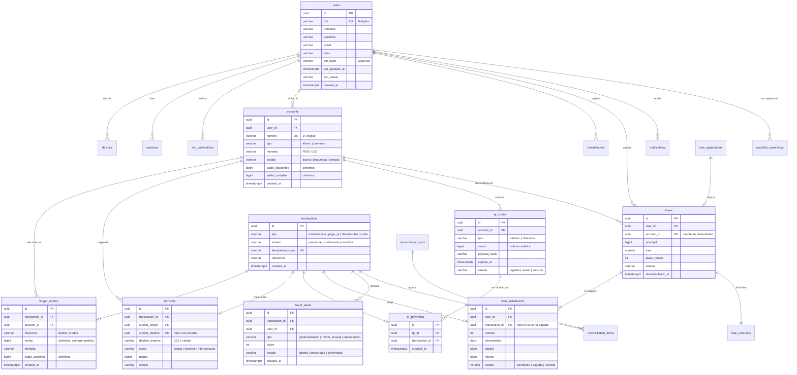

# Modelo físico de datos — CuyCash

Diseño relacional de las 6 épicas de "Banca Online Integral". Motor:
PostgreSQL 16 (Neon). El acceso a datos pasa por SQLAlchemy 2.0 en el backend y
por el patrón Repository en la app.

**Estado de implementación.** El diagrama cubre el alcance completo del MVP; el
código implementa las épicas 1 y 2. Las tablas de las épicas 3 a 6 están
diseñadas y documentadas aquí, y se crean en el sprint que les corresponde. Se
diseñan todas juntas porque el libro mayor de la épica 2 es el centro al que
las demás escriben: definirlo sin saber quién lo va a usar obliga a rehacerlo.

| Épica | Sprint | Tablas | Estado |
|---|---|---|---|
| 1 · Identidad y accesos | 1 | 8 | Implementada |
| 2 · Cuentas y libro mayor | 2 | 4 | Implementada |
| 3 · Transferencias y antifraude | 3 | 3 | Diseñada |
| 4 · Préstamos digitales | 4 | 4 | Diseñada |
| 5 · Billetera y QR | 5 | 2 | Diseñada |
| 6 · Conciliación y cumplimiento | 6 | 4 | Diseñada |

---

## Diagrama relacional

> El diagrama omite las tablas de soporte de identidad (`lockouts`,
> `login_attempts`, `otp_challenges`, `otp_tickets`) y las de cumplimiento
> (`reconciliation_runs`, `watchlist_screenings`, `notifications`,
> `audit_log`) para que sea legible. Están descritas abajo.

---

## Decisiones de diseño

### 1 · El dinero se guarda en céntimos, como entero

Ningún importe usa coma flotante. `10.10 + 20.20` en punto flotante no da
`30.30`, y en un libro mayor ese residuo es una partida descuadrada. Se guarda
el monto en la unidad mínima (céntimos de sol) como `BIGINT`, y la conversión a
soles ocurre solo al mostrar.

### 2 · Partida doble: el asiento es la verdad, el saldo es la caché

`ledger_entries` registra cada movimiento como débito o crédito contra una
cuenta. Una `transaction` agrupa los asientos de una misma operación, y la
regla es invariable:

> La suma de los débitos de una transacción es igual a la suma de sus créditos.

Esto cumple el SLA de la HU18 — atómico: débito y crédito, o ninguno — porque
los asientos de una transacción se insertan dentro de la misma transacción de
base de datos.

`accounts.saldo_disponible` es una columna, no una suma de los asientos.
Calcular el saldo sumando el historial completo es correcto pero no sostiene el
SLA de 200 ms de la HU17 cuando una cuenta acumula miles de movimientos. La
columna se actualiza en el mismo `COMMIT` que los asientos, de modo que nunca
puede divergir, y el historial sigue siendo la fuente auditable para
reconstruirla.

### 3 · Anti doble gasto: bloqueo de fila, no de tabla

Antes de debitar se toma la fila de la cuenta con `SELECT ... FOR UPDATE`. Dos
pagos simultáneos sobre el mismo saldo se serializan: el segundo espera, vuelve
a leer el saldo ya rebajado y es rechazado si no alcanza. Sin ese bloqueo, las
dos lecturas ven el mismo saldo y las dos aprueban.

Es bloqueo por fila: dos cuentas distintas no se estorban, así que el SLA de
200 ms se mantiene bajo concurrencia.

### 4 · Idempotencia por restricción única, no por lógica

`transactions.idempotency_key` tiene índice único. El cliente genera la clave y
la repite si reintenta por timeout o red caída. El segundo intento choca contra
la restricción y se devuelve la transacción original en lugar de crear otra.

Esto es lo que cumple el "una sola autorización por pago" de la HU16. Se delega
en la base y no en código porque es la única capa que ve todos los intentos
simultáneos.

### 5 · Los estados son columnas de texto acotado, no enumerados de Postgres

`ENUM` nativo obliga a una migración para añadir un valor. Con `VARCHAR` más una
restricción `CHECK` se consigue la misma garantía y el cambio es barato, que es
lo que necesita un producto que todavía está descubriendo sus estados.

### 6 · Nada se borra: los movimientos no tienen `DELETE`

Una operación equivocada se corrige con una transacción inversa que deja su
propio rastro, nunca borrando asientos. Es un requisito contable y, de paso, la
base de la trazabilidad que exige la auditoría.

---

## Tablas de soporte

### Identidad (épica 1, implementada)

| Tabla | Rol |
|---|---|
| `devices` | Teléfonos vinculados. Sin vínculo, entrar exige OTP. |
| `sessions` | Sesiones abiertas. Guarda el hash del token, no el token. |
| `lockouts` | Bloqueos vigentes por DNI y por dispositivo, con nivel de escalado. |
| `login_attempts` | Una fila por intento. Sostiene la ventana deslizante y la auditoría. |
| `otp_challenges` | Desafío OTP con su código hasheado, vigencia y contadores. |
| `otp_tickets` | Prueba de que un OTP se verificó. Lo exige el restablecimiento de PIN. |
| `kyc_verifications` | Veredicto y distancias faciales. **Nunca las imágenes.** |

### Cumplimiento y operación (épica 6, diseñada)

| Tabla | Rol |
|---|---|
| `reconciliation_runs` | Un ciclo diario de conciliación: fecha, estado, diferencias halladas. |
| `reconciliation_items` | Partida conciliada o pendiente, contra una transacción. |
| `watchlist_screenings` | Cotejo contra listas restrictivas (OFAC, PEP) en onboarding y transferencias. |
| `notifications` | Avisos de seguridad enviados al cliente, con canal y resultado. |
| `audit_log` | Registro estructurado de operaciones sensibles, con identificador de correlación. |

---

## Patrón de acceso a datos

Dos capas, cada una con su patrón, y por una razón distinta.

**Backend — SQLAlchemy 2.0 (ORM) con sesión por petición.** Se eligió ORM sobre
SQL manual por una razón de seguridad antes que de comodidad: todas las
consultas quedan parametrizadas por construcción, lo que elimina la inyección
SQL como clase de error en lugar de confiar en que nadie concatene una cadena.
Donde el ORM estorba —el bloqueo de fila del punto 3— se baja a SQL explícito
dentro del mismo modelo.

**App — Repository con interfaz de dominio.** Cada feature define su
`XRepository` en `domain/` y recibe una implementación por constructor. Esto es
lo que permite que el flavor `mock` funcione sin red y que las pruebas corran
contra una implementación en memoria con el mismo contrato. Es la regla 3 del
`CLAUDE.md`: toda interfaz nace con su `Memory*` funcional.

La frontera entre las dos es HTTP, y el contrato está en
`docs/adr/0002-backend-de-autenticacion.md`.
